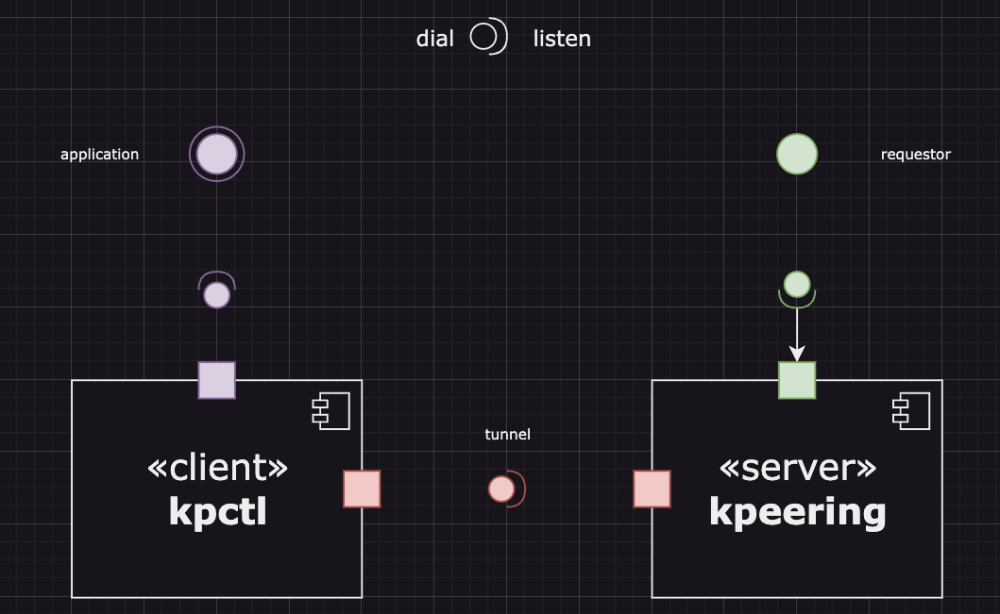
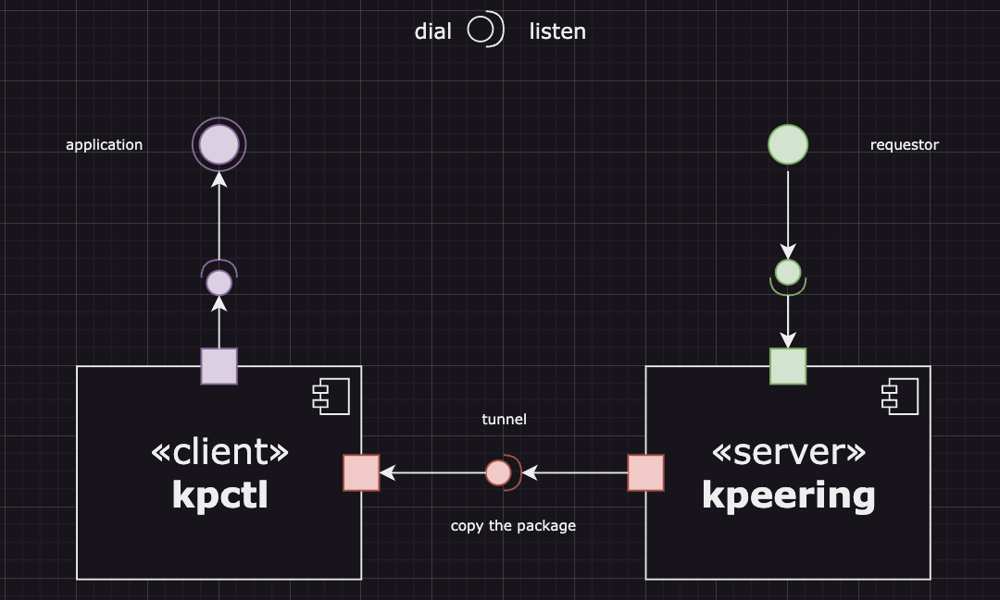
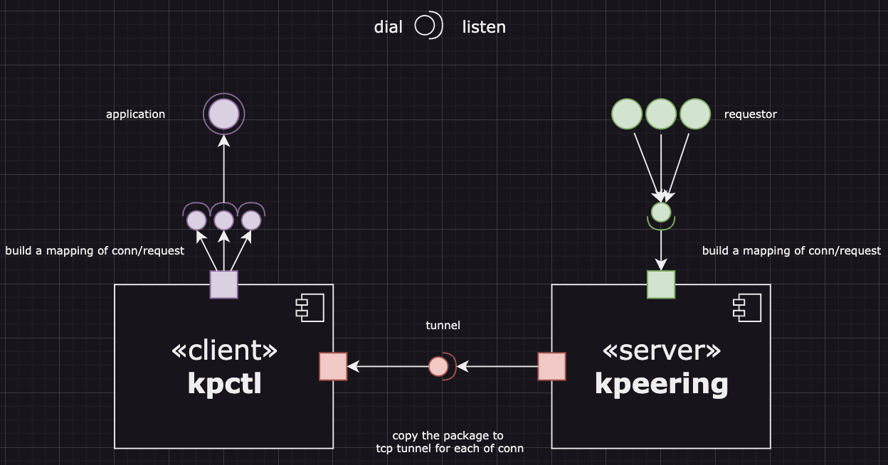

# v0 - startup

Build connection between local and remote cluster, forward the traffic via a tunnel.

Component

- kpeering: installed in cluster (as an sidecar currently), intercept the triffic and forward to local
  - interceptor: a tcp/http proxy, intercept the traffic (inbound)
  - forwarder: a tcp/http client, forward the traffic (request) from local to remote (outbound)
  - endpoint/tunnel: the tunnel connection with the local

- kpctl: installed in local, use port-forward to connect with kpeering, receive the traffic and forward to target application
  - simulator: set the environment/dns locally to simulate the remote cluster
  - endpoint/tunnel: the tunnel connection with the kpeering
  - forwarder: forward the traffic to target application (inbound)
  - interceptor: intercept the traffic from target application (outbound)

similar like an vpn, installed in both cluster/pod and local/application

## Epic: TCP

TCP is pair-to-pair, only 1 connection between the client and server.
We just need to build a tunnel and copy the packet between the remote and local.

### Task, forward remote traffic to local

- [ ] kpeering: init the interceptor
- [ ] kpeering & kpctl: build the tunnel
- [ ] kpeering: forward the traffic
- [ ] kpctl: receive the traffic and respond

### Task, forward local traffic to remote

- [ ] kpctl: the reverse direction, send msg the the server

### Example, a p2p chat application

2 users, A and B.

- A send hello to B, B send hi to A.
- B send goodbye to A, A send bye to B.

case

- both A and B in local, connect directly
- A in local, B in remote, connect via kpeering

## Epic: HTTP

Http is a request-response model, the client send a request and the server send a response. The connection is not pair-to-pair, the client may send multiple requests to the server, and the server may send multiple responses to the client.

If we have only 1 tunnel, we need to build a mapping between the request and response.

### Task, accept requests and forward to local

- [ ] kpeering: init the interceptor
- [ ] kpeering & kpctl: build the tunnel
- [ ] kpeering: forward the traffic
- [ ] kpctl: receive the traffic and respond

### Task, request to upstream via tunnel

- [ ] kpctl: the reverse direction, send msg the the server

### Example, a http application

client, server, dependency

- A call /status of B, B return 200
- A call /dependency/status of B, B call /status of C, C return 200

case

- all of them in local, connect directly
- client and dependecy in local, B in remote, connect via kpeering

## Epic: Kubernetes

### Task, install and connect kpeering in cluster

### Task, resolve the DNS

### Task, copy the environment variable

## Reference

- <https://cloudnative.to/blog/k8s-node-proxy/>
- <https://www.ywlib.com/archives/a-simple-tcp-reverse-proxy-in-golang.html>
- nocalhost
- <https://github.com/nginxinc/nginx-kubernetes-gateway>
