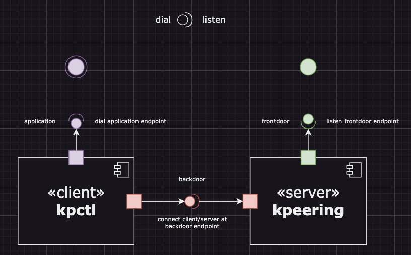
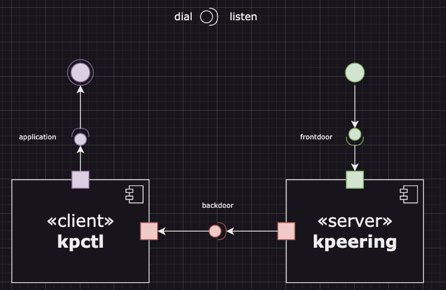
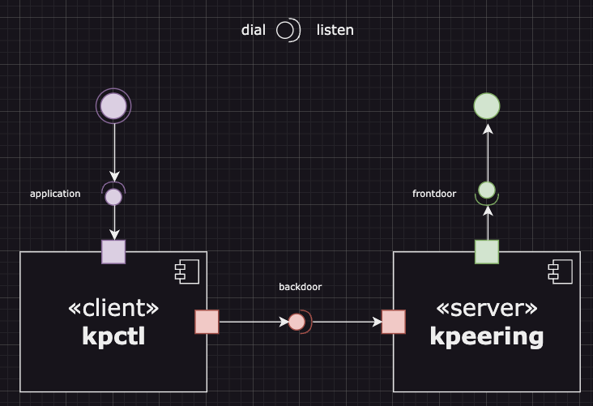

# v0 - startup

Entity

- Local: the developer machine hosts the local environment
- Local Application: the application runs locally (binary, docker)
- Cluster: the remote kubernetes cluster in cloud/internet
- Remote Application: the running pod/deployment of the application in cluster

Component

- kpctl: installed in local, init the connection with kpeering, forward the traffic locally
  - endpoint/application: connect with target application
  - endpoint/backdoor: connect with backdoor of kpeering
- kpeering: installed in cluster, accept the connection with kpctl and listen to app port to forward the traffic
  - endpoint/frontdoor: accept request from cluster
  - endpoint/backdoor: forward request to the kpctl, and return the response to the frontdoor

similar like an vpn, installed in both cluster/pod and local/application

## Epic, forward remote traffic to local

port-forward

## Epic, forward local traffic to remote

<https://cloudnative.to/blog/k8s-node-proxy/>
<https://www.ywlib.com/archives/a-simple-tcp-reverse-proxy-in-golang.html>

nocalhost

<https://github.com/nginxinc/nginx-kubernetes-gateway>

## Epic, peering localhost and remote cluster
